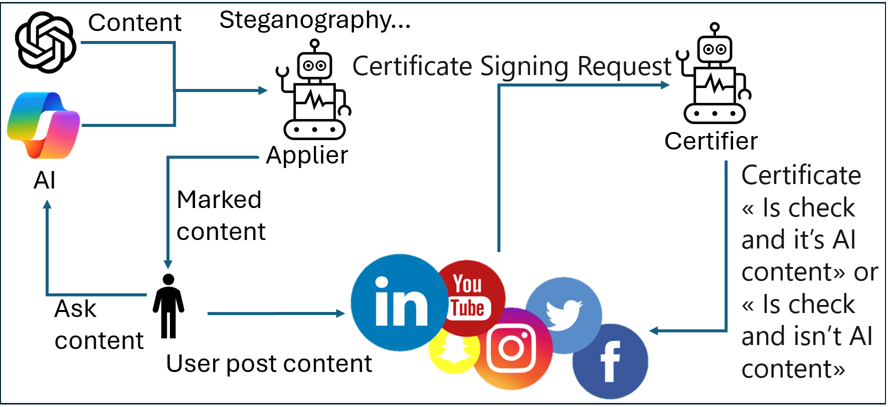

# Establishing Digital Trust: A Certification System for AI-Generated Content

## Project Overview

This project aims to address the growing challenge of distinguishing AI-generated content from human-created content in the digital realm. As AI technologies become more sophisticated, the need for a reliable method to verify the origin of digital content has never been more critical. Our research introduces a novel authentication system designed to enhance the integrity of information and ensure the trustworthiness of content in the digital landscape.

## Team Members

- Blee Benoit
- Didi Abdallah
- Leclercq Vincent
- Leroux Maxence

## Abstract

In an era defined by the rapid advancement of AI technologies, distinguishing between virtual realities and authentic digital content has emerged as a paramount challenge. Our project develops a pioneering authentication system capable of certifying the provenance of digital content, effectively differentiating between content generated by AI and that originated by humans. This initiative aims to bolster digital trust, ensuring the authenticity and integrity of content across the digital sphere.

### Architecture overview



## Key Features

- **Artificial Intelligence Models**: Incorporates cutting-edge AI technologies for content generation and analysis.
- **Applier Component**: Marks AI-generated content with invisible indicators to signal its origin.
- **Certifier Component**: Analyzes content to verify these markings and determine the content's authenticity.
- **Social Network Interface**: Facilitates seamless integration with social media platforms, promoting widespread application of content authenticity labels.

## Proof of Concept (POC)

Our POC demonstrates the system's capability to integrate these components effectively, setting the foundation for a robust solution to the challenge of digital content verification.

### Getting Started

To explore the POC, clone this repository and follow the setup instructions provided to configure each component of the system.

```bash
git clone https://github.com/Maxougit/POC-AI-Detection-structure.git
cd POC-AI-Detection-structure
pip install -r requirements.txt
```

### Usage

Edit the Toch pipeline backend refering to your environement for "picturegeneration.py"

Launch main.py for trying the démo with one text (generated by an human) and a picture generated by an AI.

### Research and Development

Our research delves into the intricacies of AI-generated content, exploring the development of generative AI technologies and their implications for the digital landscape. The project underscores the importance of maintaining the equilibrium between innovation and integrity, ensuring the reliability of content in the digital age.

### Future Directions

We recognize the scalability challenges and the need for ongoing adaptation to evolving AI technologies. Our future efforts will focus on enhancing the system's accuracy, expanding its capability to handle various content types, and ensuring its adaptability to the rapidly changing digital environment.
